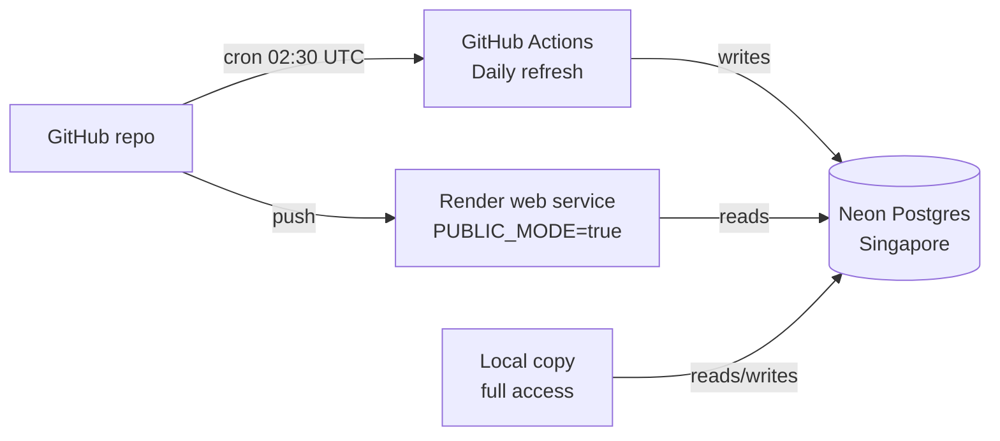
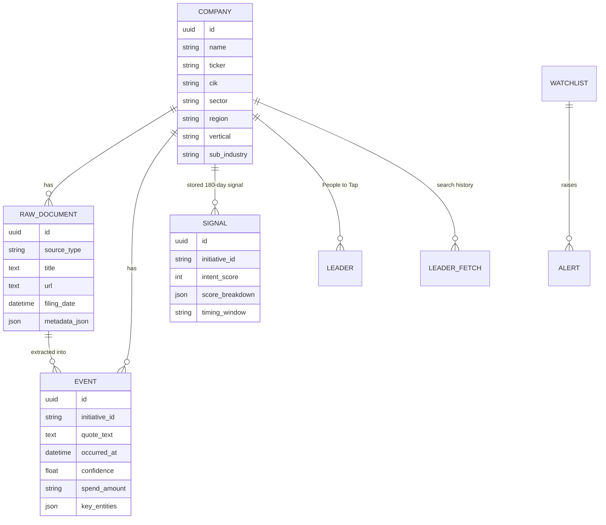

# Keenr.ai — Phase-Wise Architecture (as built)

Keenr.ai turns **public disclosures from banks and insurers** — SEC filings, earnings decks, investor-relations releases, job postings and news — into **ranked, evidence-backed opportunities** for IT-services sales teams: which account is doing what, how strongly the evidence says so, who the relevant technology leaders are, and a short written briefing on every chart.

This document started as a plan (August 2026) and has been rewritten to describe what was actually built. Each phase records **what was planned, what was built, and why it changed** — the changes are the interesting part.

> **Live:** public read-only demo on Render · data refreshed every morning at 08:00 IST by GitHub Actions into a Neon Postgres database.

---

## 1. What the product answers

| Question a seller asks | Where Keenr.ai answers it |
|---|---|
| What are banks and insurers investing in right now? | **Industry** page — seven tiles (Tech Trends, Business Trends, Regulatory, Budgets & Deals, Leadership, News, Results), each with a written summary and "View evidence" |
| Which accounts should I call, and why now? | **Opportunity** page — Featured opportunities (with the documents behind each), Rising Fast, Competitive Pressure, People to Tap, Recommended plays |
| Who exactly should I talk to? | **People to Tap** — verified senior technology leaders with LinkedIn links, matched to the opportunity |
| What is one company doing? | **Company page** — its opportunities, evidence timeline, technology vendors, leaders |
| How is the market structured? | **Companies** page — a solar-system map: verticals (stars) → sub-industries (planets) → companies (satellites) |

**Example of an output (the "signal"):**

> *Voya Financial — AI & Machine Learning — **High** (8 points = 2 filings (6) + 2 news stories (2)).* Click through to the four documents; the lead for AI at Voya is listed under People to Tap.

---

## 2. Architecture overview

```mermaid
flowchart LR
    subgraph Sources["Public sources (free / free-tier)"]
        SEC[SEC EDGAR<br/>10-K · 10-Q · 8-K]
        DECK[Earnings decks<br/>8-K exhibits]
        IR[IR press releases<br/>Exa]
        JOBS[Job postings<br/>Exa]
        NEWS[News<br/>Google News RSS · Exa]
        LI[LinkedIn profiles<br/>Exa people search]
        TED[EU TED tenders]
    end

    subgraph Pipeline["Daily pipeline (GitHub Actions, 08:00 IST)"]
        CAD[Cadence planner<br/>which sources today]
        ING[Adapters + budgets<br/>relevance + date checks]
        EXT[Extraction<br/>rules first, LLM backstop]
        SCORE[Signal engine<br/>points → High/Med/Low]
        PPL[People to Tap refresh]
        WARM[Summary warm-up<br/>grounded LLM narration]
    end

    DB[(Neon Postgres<br/>shared state)]

    subgraph Serve["Serving (Render, read-only)"]
        API[FastAPI<br/>windowed scoring per request]
        UI[Vanilla JS dashboard]
    end

    Sources --> CAD --> ING --> EXT --> SCORE --> PPL --> WARM --> DB
    DB --> API --> UI
```

**Key architectural choices**

| Decision | Why |
|---|---|
| **Monolith with clear modules** (`ingestion/`, `extraction/`, `signals/`, `people/`, `ai/`, `api/`) | One developer, one deployable; module boundaries kept so parts can split later |
| **Batch pipeline + read-only web tier** | All fetching, extraction and LLM spend happens once a day in the pipeline; the public site only reads, so a visitor can never spend an API budget |
| **Shared state in the database, not files** | The GitHub Actions runner's disk is discarded after every run — budgets, last-run status and the AI-summary cache live in `app_state` / `ai_summaries` so the pipeline and the web app see the same values |
| **Scores computed per request for the chosen window** | Re-scoring every (company, initiative) group takes ~24 ms, so the dashboard shows scores built from exactly the selected date range instead of a precomputed 180-day number under a "last 30 days" label |
| **Explainable scoring over a clever formula** | A 0–100 weighted formula ranked sensibly but could not be explained to a seller; replaced by points per document (§5, Phase 3) |
| **LLM writes sentences, code owns facts** | Every number in a summary is computed; the model only phrases it, and a validator rejects any sentence with a number or name that was not supplied (§6) |

---

## 3. Signal taxonomy

Locked early and kept closed so that extraction labels, scoring and filters stay stable. Stored in `backend/data/taxonomy.yaml`, each initiative mapped to the IT offering a vendor would pitch.

| Category | Initiatives (15) |
|---|---|
| **Technology Initiatives** | Cloud migration · AI / GenAI / ML · Data platform & analytics · Cybersecurity & zero trust · Core-system modernization · ERP / CRM / enterprise apps · DevSecOps & platform engineering |
| **Strategic Priorities** | Digital transformation · Cost optimization · ESG & sustainability tech |
| **Organizational Change** | Executive leadership change · M&A integration |
| **Spending & Procurement** | CapEx / IT budget · Vendor partnership / RFP |
| **Regulatory & Compliance** | Regulatory compliance tech |

`executive_leadership_change` is tracked (it feeds the Leadership tile and triggers People to Tap refreshes) but **is not an opportunity** — a new CIO is an entry point, not a project — so it is excluded from Featured, Rising Fast and recommendations.

**Known limitation:** a closed taxonomy cannot notice a new theme (stablecoins, agentic AI) until someone adds it. An "Emerging themes" discovery tile is on the roadmap.

**Company universe:** 683 companies seeded; the product is scoped to **199 BFSI companies**, split **98 Americas / 101 Rest of World** (headquarters from SEC addresses plus a curated table), and mapped to **4 verticals and 20 sub-industries** for the Companies map (`bfsi_taxonomy.py`, a hand-curated table that refuses to apply if any line matches zero or several companies).

---

## 4. Data sources (as used)

| Source | Access | What it contributes | Cadence | Budget control |
|---|---|---|---|---|
| **SEC EDGAR** | Free API (`data.sec.gov`, User-Agent required) | 10-K / 10-Q / 8-K text, company HQ addresses | Weekly; daily in results season | Rate-limit delay |
| **Earnings decks** | 8-K exhibits (EX-99.x) from the EDGAR filing index; `pdfplumber` for PDFs | Stated strategic pillars, spend | Weekly; daily in results season | — |
| **IR press releases** | Exa search (news category) | Announcements before they reach filings | Mon/Thu; daily in results season | Own monthly Exa budget |
| **Job postings** | Exa search (no category, so job boards appear) | Hiring intent — "Head of GenAI" | Weekly | Own monthly Exa budget |
| **News (full text)** | Exa search | Partnerships, launches | Daily | Monthly budget, daily sub-budget, least-recently-fetched rotation |
| **News (headlines)** | Google News RSS | Breadth across all 199 companies | Daily | Free; `when:14d` window |
| **Leaders** | Exa "linkedin profile" category | People to Tap | On demand + leadership-change trigger | Own monthly budget, 15 searches/day |
| **Public tenders** | EU TED API | Public-sector IT RFPs (separate stream) | Daily | Free |

**Results seasons** (daily filings/IR polling): 10 Jan–31 Mar, 10 Apr–25 May, 10 Jul–25 Aug, 10 Oct–25 Nov (`ingestion/cadence.py`).

**Every document must pass three checks before it is stored:**

1. **About the company** — the company's name (or a verified alias) must appear; homonyms are rejected (a ticker like "DE" matching the Spanish word "de" is not Deere).
2. **Has a provable publication date** — from the API, else the URL (`/2026/01/20/`), else the page's own publication metadata (JSON-LD `datePublished`, `article:published_time`), else the byline. *Modified/updated* timestamps are ignored. **No date → dropped.** (Before this rule, undated vendor case studies from 2021–2024 were stamped with the fetch date and made up three quarters of the "last 30 days" view.)
3. **Inside the news window** — the daily run requests only the last 14 days (`NEWS_LOOKBACK_DAYS`) and drops anything older.

**Considered and not used:** NewsAPI/GNews (Exa + RSS gave full text and breadth for free), USPTO patents (the API moved to a key-gated portal whose contract could not be verified; the adapter stays as a no-op), SAM.gov (key required), Apollo / Perplexity for people data (work-email signup, or unverifiable LLM recall of names and URLs).

---

## 5. Phases — planned vs built

### Phase 0 — Foundation ✅

| Planned | Built |
|---|---|
| BFSI + Healthcare, ~500 companies | **BFSI only**, 199 companies (683 seeded; others parked) — depth in one market beat breadth |
| Taxonomy v1, 15–25 initiatives | 5 categories, 15 initiatives, each mapped to an IT offering |
| Postgres + MinIO + Redis | SQLite locally → **Neon Postgres**; no object store (raw text is a write-only archive and is skipped in the cloud); no Redis (no queue needed at this scale) |

**Exit met:** one company → one filing → one extracted initiative → stored event.

### Phase 1 — MVP ingestion ✅

| Planned | Built |
|---|---|
| EDGAR poller + news API | `SecEdgarAdapter` (10-K/10-Q/8-K, key sections) + Google News RSS + Exa news |
| Rules + small LLM extraction | **Rules first** (`extraction/rules.py`: taxonomy keywords, spend and timing patterns, ~30 known technology vendors), **LLM only as a backstop** (see §6) |
| Celery + Redis workers | In-process APScheduler locally; **GitHub Actions** in production (Phase 7) |
| Simple dashboard | Replaced entirely by the Industry / Opportunity / Companies design (Phase 6) |

### Phase 2 — Multi-source enrichment ✅ (patents deferred)

| Planned | Built |
|---|---|
| IR releases, career pages, patents, earnings decks | IR (Exa), careers (Exa, no category so job boards surface), earnings decks (EDGAR exhibits, PDF + HTML) — **patents deferred** (unverifiable API contract) |
| Entity resolution | Company aliases + a relevance guard on every document; vendor-name normalisation (Azure ↔ Microsoft Azure, AWS ↔ Amazon Web Services) |
| Deduplication | URL-level dedup at ingest; **per-document counting** in scoring (one article = one piece of proof, however many sentences mention the theme) |
| Separate budgets per Exa consumer | Yes — one tracker per purpose so news cannot starve IR, careers or people search |

### Phase 3 — Signal engine & scoring ✅ (redesigned)

**Planned:** an intent score 0–100 from weighted evidence, corroboration, recency and spend, later an ML model.

**Built, then deliberately replaced.** The 0–100 formula (saturating evidence curve + corroboration + recency + spend) ranked accounts sensibly, but when asked *"what does 88 mean for Voya?"* the answer needed a formula and a table. Two findings sealed it:

- It counted **sentences**, not documents — one Azure article about Voya produced 8 events, one AI job ad 7. The score measured how long-winded a source was.
- Two of its four parts carried little signal: recency was a near-constant in a 30-day view, and "spend" read revenue figures as IT budgets.

**Current model — points per unique document:**

| Evidence | Points | Reasoning |
|---|---|---|
| SEC filing · earnings deck · IR release | **3** | The company said it itself |
| Job posting | **2** | The company is hiring for it |
| News story | **1** | The press reported it |

**Strength:** **High ≥ 6 points · Medium 3–5 · Low 1–2**, shown with its working ("8 points = 2 filings (6) + 2 news stories (2)"). Anyone can check it by hand.

Also built: timing window from source mix (disclosure + hiring → 0–3 months; disclosure only → 3–6; news only → 6–12), peer context (others in the same industry on the same initiative), watchlists and threshold alerts (in-app; Slack/email deferred), and **windowed scoring** — every score is recomputed for the selected date range on each request.

### Phase 4 — Productization ✅ (scoped to a single-user tool, then a public demo)

| Planned | Built / decided |
|---|---|
| CSV exports, CRM webhook | Built (signals, leads, events CSV; generic JSON webhook, inert until configured) |
| Heatmaps, trends, timelines | Built, then folded into the Industry / Company pages |
| Source health & freshness SLA | Built (`SourceRun` per source per run; 48 h freshness flag) |
| Auth, tenants, API keys, Elasticsearch, split workers | **Skipped** — single-user analyst tool; the public demo is read-only instead of authenticated |

### Phase 5 — Geography, coverage, tenders ✅

- **Region** added to companies (first `ALTER TABLE` on a populated table, via an idempotent `ensure_columns`): SEC business address where available, curated HQ table otherwise. All 199 BFSI companies classified, 0 unknown; US institutions without a CIK (USAA, State Farm, Fannie Mae…) correctly land in Americas.
- **Coverage backfill** for companies with no events.
- **EU TED tenders** as a separate public-sector stream (their buyers are ministries and hospitals, not banks); strict buyer matching after "de" matched Deere.
- **Vendor graph**: which technology vendors each company names.

### Phase 6 — Seller-first UI and the AI layer ✅ (new)

Not in the original plan. The raw "signal feed" and ranked-signals views answered *what exists*; sellers needed *what to do*. Rebuilt as three pages:

- **Industry** — seven tiles, each with a grounded AI summary that describes exactly what its chart shows, and "View evidence" to the source documents.
- **Opportunity** — KPIs; **Featured opportunities** with the documents behind each row; **Rising Fast** (same company-initiative pair scored against the previous equal-length window); **Competitive Pressure** (bar chart of peers on the same initiative); **People to Tap**; **Recommended plays** (engage now, lead theme, momentum, peer pressure — assembled from the page's own figures, not model-written).
- **Companies** — solar-system map of the BFSI universe; a company page with masonry-packed tiles.
- Regions switch instantly (client cache with 3-minute TTL, region prefetch, stale-response guards); every infographic animates in; a radar loading screen covers the first load and date-range changes.

### Phase 7 — Always-on deployment ✅ (new)

- **Neon Postgres** replaces SQLite so the pipeline, the public site and the local copy share one database; migration script copies all 13 tables and verifies row counts.
- **GitHub Actions** runs the same `run_daily()` as the local scheduler; a once-per-day guard in the shared database prevents double ingestion; a `concurrency` group prevents overlapping runs; skips cleanly until secrets exist.
- **Render** serves the app in **public read-only mode**: one middleware refuses every POST/PUT/PATCH/DELETE under `/api`, missing summaries are never generated on a visitor's request, background people-search is off, and no LLM or search API keys are deployed to the web tier.
- **LLM provider fallback** so a spent Groq budget no longer blanks the summaries (§6).

**Portability issues met in the move to Postgres** (worth knowing): SQLite ignores `VARCHAR(n)` so a 1,549-character scraped title went unnoticed until Postgres refused it (free-text columns are now `TEXT`); SQLAlchemy 2.1 changed the default driver for `postgresql://` URLs, so the driver is now named explicitly.

---

## 6. The AI layer

| Use | Model / method | Guardrail |
|---|---|---|
| **Initiative extraction** | Keyword rules first; LLM (JSON mode, taxonomy in the prompt) only when rules found nothing or the document is a first-party disclosure | Output must parse as JSON and map to a taxonomy id; token budget with a reserve for summaries |
| **Tile summaries** | LLM rewrites statements the code composed ("29% of 297 technology signals are AI…") | Rejected if any number or named entity is not in the supplied facts, or if it is not plain prose of the right length → falls back to the computed sentence, labelled as such |
| **People to Tap** | Retrieval (Exa LinkedIn search) + deterministic verification — **no LLM** | Headline must name the company (not a subsidiary), carry a senior title, and not describe a former role; URLs are never constructed |
| **Recommendations** | Assembled from the page's figures — **no LLM** | Nothing inferred |

**Provider chain:** Groq (`openai/gpt-oss-120b`, benchmarked against the other models the key could reach) → OpenRouter (free Nemotron 120B, with Gemma and Qwen as backups) → Gemini (`gemini-3.8-flash`, with backups). The next provider is called only if the previous one is out of budget, rate-limited, errors, **or returns a draft the validator rejects**. Each fallback has a daily cap and a reserve that bulk extraction cannot spend.

**Cost controls:** summaries cached by a hash of their facts (a changed fact is a new key, so a cached summary is never stale); summaries written by the morning warm-up, never on the request path; Groq's 200k tokens/day tracked per IST day with a 45k reserve for summaries.

---

## 7. Tech stack (as built)

| Layer | Choice | Instead of (planned) | Why |
|---|---|---|---|
| Backend | Python 3.12 + FastAPI | — | Strong scraping/NLP ecosystem, typed routes, OpenAPI docs free |
| ORM / DB | SQLAlchemy 2 · SQLite (dev) → **Neon Postgres** | Self-hosted Postgres | Serverless, free tier, shared by pipeline and web |
| Scheduling | APScheduler (local) · **GitHub Actions cron** (prod) | Celery + Redis | A once-a-day batch needs a cron, not a queue |
| Raw storage | Local text archive (dev only) | MinIO | Raw text is never read back; not worth a service |
| LLM | Groq → OpenRouter → Gemini | Ollama / local models | Free hosted inference, fast; fallback for quota limits |
| Search / news | Exa + Google News RSS | NewsAPI / GNews | Full text + breadth, both free-tier |
| PDF | pdfplumber | — | Earnings-deck exhibits |
| Frontend | Vanilla JS + hand-built SVG/CSS charts | Next.js + Tailwind | Served by FastAPI as static files; no build step |
| Hosting | **Render** (web, read-only) | Railway / Fly.io | GitHub-connected deploys for a long-running Python server |

---

## 8. Data model (core tables)

Also: `app_state` (budgets, last run, per-provider LLM usage), `ai_summaries` (fact-hash → text), `tenders`, `source_runs`, `ingestion_jobs`.

**Volumes (29 Sep 2026):** 683 companies (199 BFSI) · 2,838 documents · 4,571 events · 1,101 stored signals · 434 verified leaders · 295 cached summaries · 580 tenders.

---

## 9. Guardrails

- **Evidence over assertion** — every score, summary and recommendation links to the documents behind it.
- **No invented facts** — LLM output is validated against supplied facts; failures fall back to computed text, marked as such.
- **No invented dates** — undated documents are dropped rather than presented as new.
- **No guessed people** — names, titles and profile URLs come only from verified search results.
- **Read-only public surface** — writes and spend are impossible from the deployed site.
- **Secrets** — in `.env` (never committed) and GitHub/Render secrets; each commit is scanned for key patterns before push.

---

## 10. Status and next

| Area | Status |
|---|---|
| Phases 0–7 | Built and live |
| Deferred | Patents (USPTO key), SAM.gov (key), Slack/email alerts, multi-tenant auth |
| Next (AI) | **Evaluation harness** for extraction precision and summary faithfulness → **cited RAG** over the document store for free-form questions → an **account-brief agent** that assembles a one-page brief per company from the same grounded tools |
| Next (product) | Emerging-themes discovery (open-set), market-chatter filter for news, server-side page cache for Neon latency |
