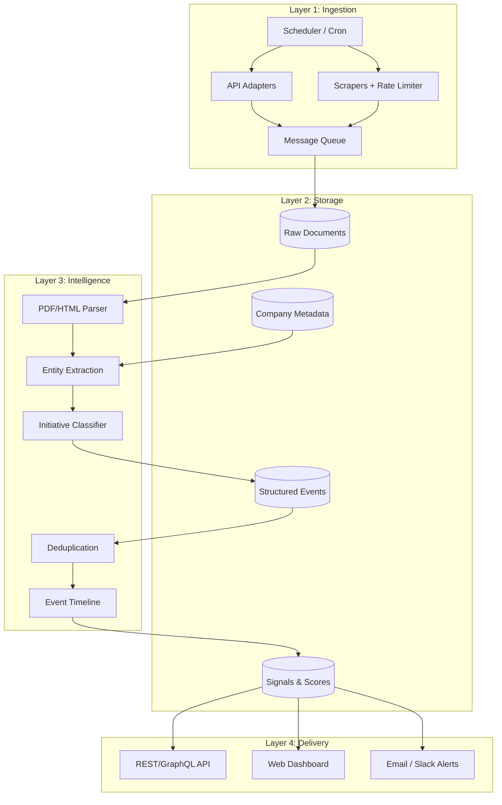
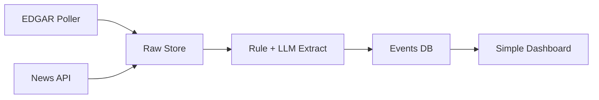
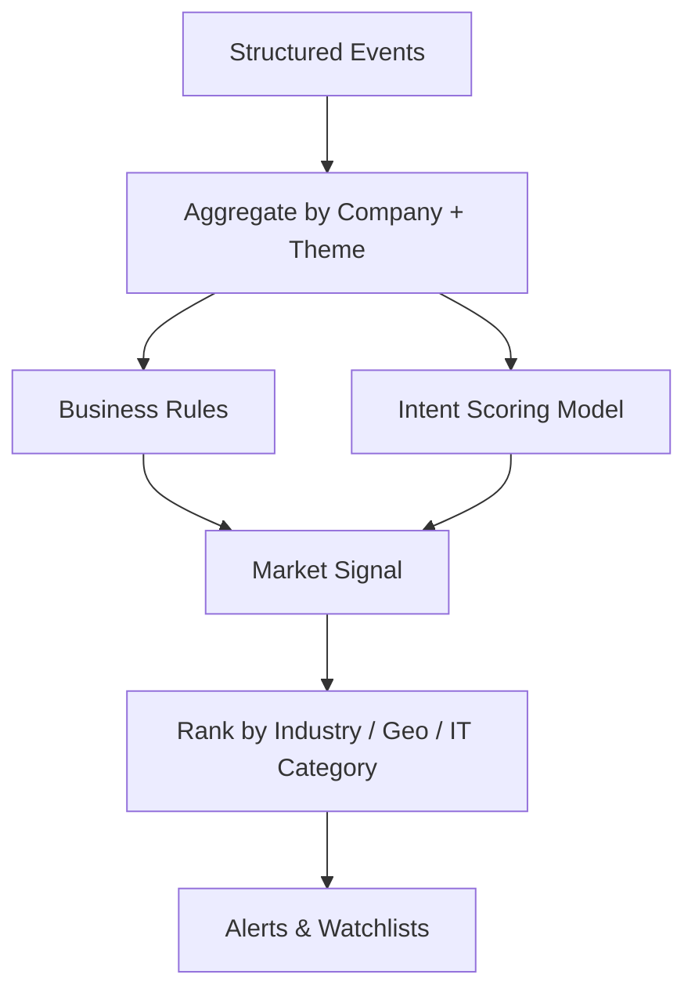
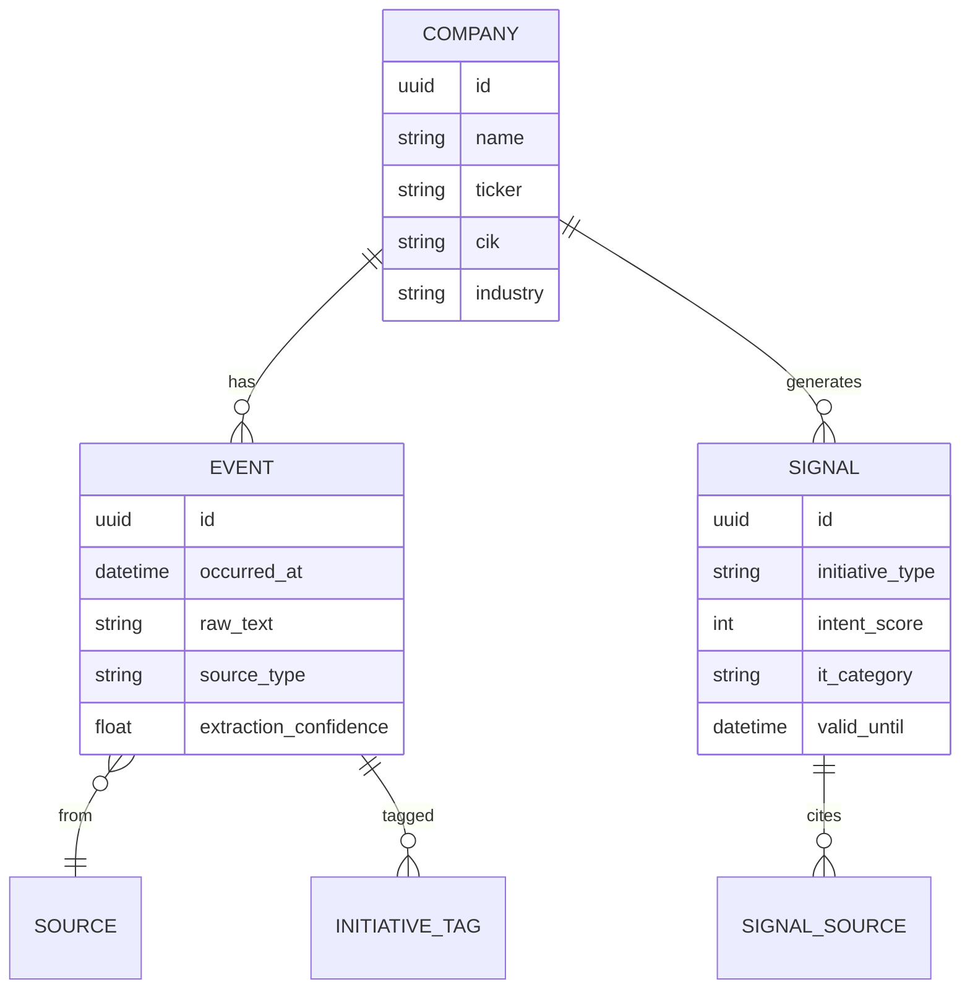

# Market Signals Platform — Phase-Wise Development Architecture

A system that turns **public company disclosures** (filings, press releases, earnings, hiring, patents, news) into **actionable market signals** for IT products and services vendors.

---

## 1. Vision & Core Concept

```mermaid
flowchart LR
    subgraph Sources["Public Data Sources"]
        SEC[SEC / EDGAR]
        NEWS[News & PR]
        JOBS[Job Postings]
        PAT[Patents]
        IR[Investor Relations]
    end

    subgraph Platform["Signal Platform"]
        ING[Ingestion]
        NLP[Extraction & NLP]
        ENT[Entity Resolution]
        SIG[Signal Engine]
        SCORE[Scoring & Ranking]
    end

    subgraph Output["For IT Vendors"]
        DASH[Dashboard]
        API[API / Alerts]
        CRM[CRM Integrations]
    end

    Sources --> ING --> NLP --> ENT --> SIG --> SCORE --> Output
```



**Example signal:**

> *"Global bank disclosed $200M cloud modernization program + 40 Azure architect hires in Q2 → High intent for cloud migration services in BFSI."*

---

## 2. Signal Taxonomy (Define Early)

| Category | Examples | IT Vendor Relevance |
|----------|----------|---------------------|
| **Technology Initiatives** | Cloud migration, AI/ML, data platform, cybersecurity | Direct service/product fit |
| **Strategic Priorities** | Digital transformation, cost optimization, ESG | Budget & timing signals |
| **Organizational Change** | New CIO/CTO, restructuring, M&A | Decision-maker & entry point |
| **Spending Signals** | CapEx, vendor RFPs, partnership announcements | Procurement window |
| **Regulatory / Compliance** | GDPR, HIPAA, PCI, AI regulation | Compliance-driven IT spend |
| **Hiring Patterns** | Roles, skills, geo expansion | Implementation readiness |

Lock this taxonomy in **Phase 0** — it drives scraping targets, NLP labels, and dashboard filters.

---

## 3. High-Level System Architecture



---

## 4. Free Data Sources Matrix

| Source | Method | Signal Type | Notes |
|--------|--------|-------------|-------|
| **SEC EDGAR** | Free API | Strategy, risk, CapEx, M&A | 10-K, 10-Q, 8-K — primary for US public cos |
| **Company IR / RSS** | Scrape + RSS | Initiatives, guidance | Earnings decks, press releases |
| **NewsAPI / GNews / Mediastack** | Free tier API | Announcements, partnerships | Rate limits; cache aggressively |
| **USPTO / Google Patents** | Free API | R&D direction, tech focus | Lagging but strategic |
| **Career pages / LinkedIn jobs** | Scrape (careful) | Hiring intent, stack | Prefer company career pages over LinkedIn |
| **GitHub public orgs** | Free API | Open-source stack signals | Good for tech-native firms |
| **Wikidata / OpenCorporates** | Free API | Company metadata, hierarchy | Entity resolution |
| **EU / gov registers** | Scrape/API | Regulatory, tenders | EU TED for public procurement |
| **Earnings transcripts** | Scrape (Seeking Alpha, etc.) | Stated priorities | Check ToS; prefer official IR PDFs first |

**Scraping rule:** Use APIs first; scrape only when no API exists, with rate limits, robots.txt respect, and cached snapshots.

---

## 5. Phase-Wise Development Plan

### Phase 0 — Foundation (2–3 weeks)

**Goal:** Scope, taxonomy, and a thin vertical slice.

| Deliverable | Details |
|-------------|---------|
| Signal taxonomy v1 | 15–25 initiative types mapped to IT offerings |
| Target industries v1 | Start with 2: **BFSI + Healthcare** (rich public disclosure) |
| Company universe | ~500 companies (S&P 500 + mid-cap in target sectors) |
| Legal review | robots.txt, SEC fair use, GDPR if EU data |
| Tech choices | See Section 6 |

**Architecture decisions:**

- Monolith-first (faster iteration) with clear module boundaries
- PostgreSQL + object storage (S3-compatible / MinIO)
- Redis for queue + cache

**Exit criteria:** One company → one filing → one extracted initiative → stored as event.

---

### Phase 1 — MVP Ingestion Pipeline (4–6 weeks)

**Goal:** Automated pipeline for SEC + news for 2 industries.



| Component | Implementation |
|-----------|----------------|
| **EDGAR adapter** | Poll 8-K, 10-K; download filings; parse HTML sections (Item 1, 1A, 7) |
| **News adapter** | NewsAPI/GNews by company name + ticker |
| **Company master** | CIK, ticker, name aliases, industry NAICS |
| **Extraction v1** | Keyword rules + small LLM (Ollama/local or free tier) for initiative sentences |
| **Dashboard v0** | Company page: recent events, initiative tags, source links |

**Free stack:** Python (FastAPI), Celery + Redis, PostgreSQL, MinIO.

**Exit criteria:** Daily refresh for 500 companies; <24h latency on new 8-K; dashboard shows last 30 days of signals.

---

### Phase 2 — Multi-Source Enrichment (6–8 weeks)

**Goal:** Richer signals from jobs, IR, patents; better entity resolution.

| New sources | Purpose |
|-------------|---------|
| IR RSS / press release scrape | Initiatives before filings |
| Career page scraper | Role-based intent (e.g. "Head of GenAI") |
| Patent API | Long-term tech bets |
| Earnings presentation PDFs | Strategic pillars from slides |

| Intelligence upgrades | Details |
|----------------------|---------|
| **Entity resolution** | Match "JPMorgan", "JPM", "Chase" → one company_id |
| **Deduplication** | Same initiative from news + 8-K → one signal, multiple sources |
| **Confidence score** | Source weight + recency + corroboration |
| **Initiative classifier v2** | Fine-tuned or prompt-tuned taxonomy labels |

**Exit criteria:** ≥3 sources per high-value signal; confidence score on every event; industry filter works.

---

### Phase 3 — Signal Engine & Scoring (6–8 weeks)

**Goal:** Turn raw events into ranked, actionable market signals.



| Signal types | Logic example |
|--------------|---------------|
| **Intent score (0–100)** | Weight: filing mention + hiring + news volume |
| **Timing** | "Announced Q1, hiring Q2 → likely RFP in Q3" |
| **IT category mapping** | "Data lake + ML hires" → Analytics / AI services |
| **Competitive context** | Peer companies in same industry with similar signals |

| Features | |
|----------|--|
| Watchlists | IT vendor tracks 50 target accounts |
| Alerts | Slack/email when score crosses threshold |
| Signal explainability | "Why this signal?" with source citations |

**Exit criteria:** IT vendor can define ICP (industry + initiative type) and get weekly ranked lead list with citations.

---

### Phase 4 — Productization (8–10 weeks)

**Goal:** API, multi-tenant SaaS shape, exports, basic analytics.

| Layer | Features |
|-------|----------|
| **API** | REST: companies, signals, search, filters; API keys |
| **Dashboard** | Industry heatmaps, trend charts, company timelines |
| **Exports** | CSV, webhook to CRM (HubSpot free tier / Salesforce later) |
| **Auth & tenants** | Orgs, roles, saved searches |
| **Admin** | Source health, scrape failures, data freshness SLA |

**Architecture shift (if needed):**

- Split ingestion workers from API service
- Add Elasticsearch/OpenSearch for full-text search (or PostgreSQL FTS first)

**Exit criteria:** 3 pilot IT vendor users on shared infra; API docs; 99% ingestion job success rate.

---

### Phase 5 — Scale & Intelligence (ongoing)

**Goal:** More industries, geographies, predictive layer.

| Expansion | |
|-----------|--|
| Industries | Retail, manufacturing, energy, public sector |
| Geographies | UK Companies House, EU filings, ASX |
| Procurement | Tender scrapers (SAM.gov, TED) |
| Predictive | "Likely to issue RFP in 90 days" from historical patterns |
| Graph | Company ↔ initiative ↔ vendor ↔ peer relationships |

| Ops | |
|-----|--|
| Observability | Prometheus, Grafana, source lag metrics |
| Data quality | Human-in-the-loop review queue for low-confidence extractions |
| Cost control | Scraping proxies only where needed; LLM batching |

---

## 6. Recommended Tech Stack (Free / Low-Cost Friendly)

| Layer | Choice | Rationale |
|-------|--------|-----------|
| **Backend** | Python 3.12 + FastAPI | Strong NLP/scraping ecosystem |
| **Workers** | Celery or ARQ + Redis | Scheduled ingestion |
| **DB** | PostgreSQL | JSONB for events, FTS for search |
| **Object store** | MinIO (self-hosted) | Raw PDFs/HTML |
| **Scraping** | Playwright + Scrapy | JS-heavy IR sites |
| **NLP** | spaCy + Ollama (Llama/Mistral) | Free local extraction |
| **Frontend** | Next.js or React + Tailwind | Dashboard |
| **Infra** | Docker Compose → later Railway/Fly.io free tiers | Simple deploy |

---

## 7. Data Model (Core Entities)



---

## 8. Legal & Ethical Guardrails

- **SEC data:** Public domain; cite EDGAR links.
- **Scraping:** Respect robots.txt; rate limit; store only public pages.
- **LinkedIn:** Avoid aggressive scraping; prefer official career sites.
- **LLM outputs:** Always link to source sentences; no fabricated initiatives.
- **Privacy:** B2B public data only; no personal employee profiling beyond public job titles.

---

## 9. Success Metrics by Phase

| Phase | KPI |
|-------|-----|
| 0 | Taxonomy + 10 manual signal examples validated with 2 IT sales users |
| 1 | 500 cos, 1K+ events/month, extraction precision >70% on sample |
| 2 | ≥40% signals corroborated by 2+ sources |
| 3 | Pilot users report ≥5 qualified conversations/month from signals |
| 4 | API p95 <500ms; weekly active users on dashboard |
| 5 | Coverage 5K+ companies, 3+ geographies |

---

## 10. Suggested Build Order (First 90 Days)

```text
Week 1–2   Phase 0: Taxonomy, company list, EDGAR spike
Week 3–6   Phase 1: Ingestion + extraction + basic UI
Week 7–10  Phase 2: News + IR + entity resolution
Week 11–14 Phase 3: Scoring + watchlists + alerts
Week 15+   Phase 4: API hardening + pilots
```

---

## Summary

| Phase | Focus | Primary output |
|-------|--------|----------------|
| **0** | Definition | Taxonomy, company universe, legal bounds |
| **1** | MVP | SEC + news → events → simple dashboard |
| **2** | Depth | Jobs, IR, patents, dedup, confidence |
| **3** | Intelligence | Scored signals, IT mapping, alerts |
| **4** | Product | API, multi-tenant, CRM hooks |
| **5** | Scale | More markets, tenders, prediction |

---

## Next Steps

1. **Scaffold the repo** (monorepo: `ingestion/`, `api/`, `web/`, `shared/`)
2. **Spike SEC EDGAR** for one company (e.g. JPMorgan) end-to-end
3. **Draft the initiative taxonomy** as a YAML config file IT vendors can customize
